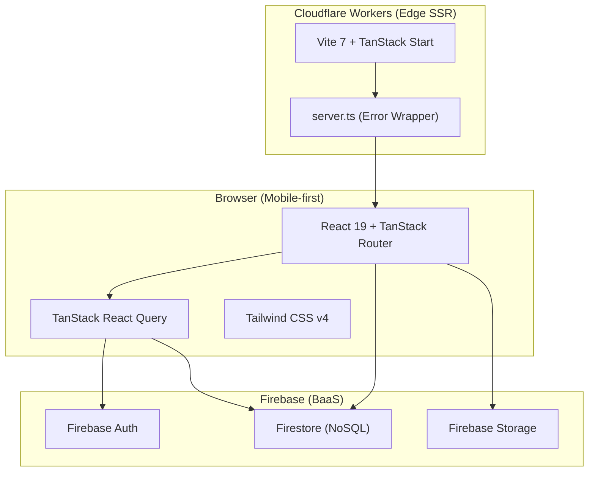
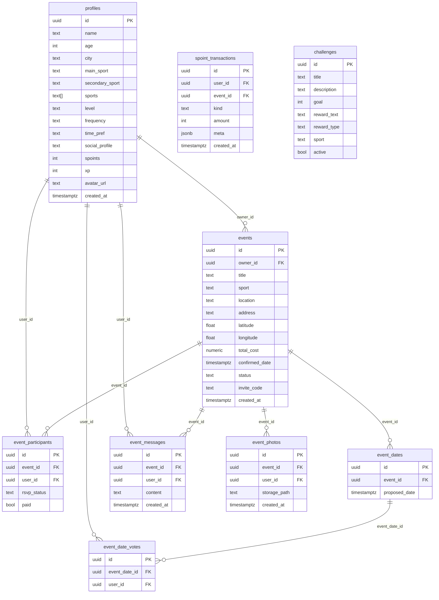
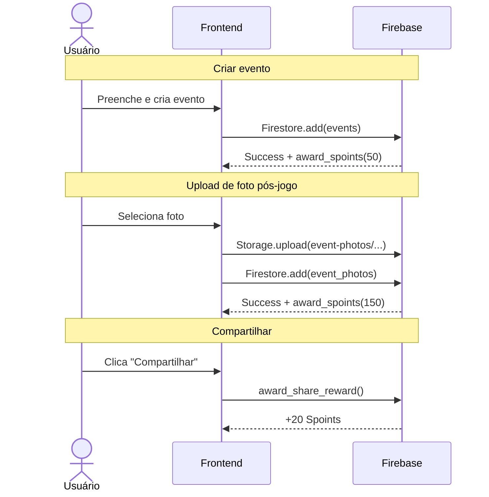
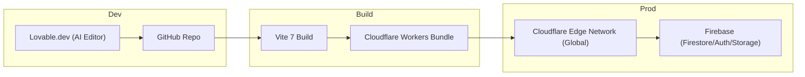

# Spoint Play Hub — Technology Walkthrough

> **Repo:** `github.com/Venturacci/spoint-play-hub`
> **Tipo de aplicação:** Web App mobile-first com SSR, focado em organização de jogos esportivos entre amigos e gamificação (Spoints).

---

## 1. Visão Geral da Arquitetura



**Resumo:** O app é uma **SPA com SSR na edge** (Cloudflare Workers) alimentada por **Firebase** como backend completo. Toda a stack é TypeScript end-to-end.

---

## 2. Stack Tecnológica Detalhada

### 2.1 Frontend — Core

| Tecnologia | Versão | Papel |
|---|---|---|
| **React** | `19.2.0` | Biblioteca de UI (com server components support) |
| **TanStack Router** | `1.168.x` | File-based routing com type-safety total |
| **TanStack React Query** | `5.83.x` | Data fetching, cache, invalidation |
| **TanStack Start** | `1.167.x` | Framework SSR (substitui Next.js/Remix) |
| **TypeScript** | `5.8.3` | Type-safety em toda a stack |

### 2.2 Frontend — UI & Styling

| Tecnologia | Papel |
|---|---|
| **Tailwind CSS v4** | Design system utilitário (configurado via `@theme inline`) |
| **Radix UI** | 25+ componentes headless acessíveis (Dialog, Popover, Tabs, etc.) |
| **shadcn/ui** | 46 componentes pré-estilizados em `src/components/ui/` |
| **Lucide React** | Biblioteca de ícones SVG |
| **Sonner** | Notificações toast |
| **Recharts** | Gráficos (preparado para dashboards futuros) |
| **Embla Carousel** | Carrossel horizontal (galeria de fotos) |
| **Vaul** | Drawer bottom-sheet nativo (mobile UX) |
| **Leaflet + React Leaflet** | Mapas interativos para localização de eventos |

### 2.3 Build & Tooling

| Tecnologia | Versão | Papel |
|---|---|---|
| **Vite** | `7.3.1` | Bundler e dev server |
| **@lovable.dev/vite-tanstack-config** | `1.5.1` | Preset que embute plugins de TanStack Start, Cloudflare, Tailwind, etc. |
| **@cloudflare/vite-plugin** | `1.25.x` | Build para Cloudflare Workers |
| **ESLint** | `9.32.x` | Linting (com plugin react-hooks e prettier integration) |
| **Prettier** | `3.7.x` | Formatação de código |

### 2.4 Backend — Firebase

| Componente | Uso no projeto |
|---|---|
| **Firebase Auth** | Login/cadastro (OAuth + email), integração com Firestore |
| **Firestore** | Banco de dados NoSQL orientado a documentos (Collections: profiles, events, etc.) |
| **Firebase Storage** | Bucket `event-photos` para fotos de jogos |

### 2.5 Infraestrutura & Deploy

| Camada | Tecnologia |
|---|---|
| **Hosting/SSR** | **Cloudflare Workers** (edge, global) via `wrangler.jsonc` |
| **CI/CD** | **Lovable Cloud** (integração automatizada) |
| **BaaS** | **Firebase** (Firestore + Auth + Storage) |
| **CDN** | Cloudflare (embutido no Workers) + Firebase Storage CDN |

---

## 3. Estrutura do Projeto

```
spoint-play-hub/
├── .env                          # Variáveis de ambiente (Firebase)
├── .lovable/plan.md              # Plano de features (Spoints system)
├── wrangler.jsonc                # Config Cloudflare Workers
├── vite.config.ts                # Vite + TanStack Start config
├── components.json               # shadcn/ui config
├── firebase.json                # Config Firebase Emulators
├── firestore.rules              # Regras de segurança Firestore
├── storage.rules                # Regras de segurança Storage
├── src/
│   ├── server.ts                 # SSR entry (error wrapper p/ Cloudflare)
│   ├── start.ts                  # TanStack Start bootstrap
│   ├── router.tsx                # Router + QueryClient factory
│   ├── routeTree.gen.ts          # Auto-generated route tree
│   ├── styles.css                # Design system (Tailwind v4 + tokens Spoint)
│   ├── routes/                   # File-based routing
│   │   ├── __root.tsx            # Root layout (HTML shell, SEO meta, QueryProvider)
│   │   ├── index.tsx             # Home — eventos, convites pendentes
│   │   ├── login.tsx             # Auth (Firebase Auth UI)
│   │   ├── onboarding.tsx        # Perfil esportivo do usuário
│   │   ├── criar.tsx             # Criar novo evento
│   │   ├── eventos.$eventId.tsx  # Detalhe do evento (RSVP, votação, racha, fotos)
│   │   └── recompensas.tsx       # Loja de recompensas (em breve)
│   ├── components/
│   │   ├── AppShell.tsx          # Layout wrapper (max-width mobile + desktop expand)
│   │   ├── BottomNav.tsx         # Navegação inferior mobile
│   │   ├── EventMap.tsx          # Leaflet map para eventos
│   │   ├── InviteSheet.tsx       # Bottom sheet de convite
│   │   ├── AddressSearch.tsx     # Busca de endereço
│   │   ├── SpointLogo.tsx        # Logo SVG
│   │   └── ui/                   # 46 componentes shadcn/ui
│   ├── hooks/
│   │   ├── useAuth.ts            # Auth state + redirect guard
│   │   └── use-mobile.tsx        # Detecção de viewport mobile
│   ├── integrations/
│   │   └── lovable/
│   │       └── index.ts          # Integração com Lovable Cloud
│   ├── lib/
│   │   ├── firebase/
│   │   │   └── client.ts         # Singleton Firebase (Auth, Firestore, Storage)
│   │   ├── spoints.ts            # Regras de gamificação + upload foto + RPC share
│   │   ├── sportImages.ts        # Mapeamento esporte → imagem
│   │   ├── constants.ts          # SPORT_EMOJI e constantes
│   │   ├── calendar.ts           # Google Calendar URL builder
│   │   ├── ics.ts                # Gerador de arquivo .ics
│   │   ├── authRedirect.ts       # Normalização de redirect path
│   │   ├── error-capture.ts      # Captura de erros SSR
│   │   ├── error-page.ts         # Página de erro branded
│   │   └── utils.ts              # cn() — clsx + tailwind-merge
│   └── assets/
│       ├── spoint-logo.png       # Logo principal
│       ├── spoint-logo-white.png # Logo branco
│       ├── ads/                  # Banners patrocinados (Centauro)
│       └── sports/               # Imagens de esportes
```

---

## 4. Schema do Banco de Dados



### Tabelas e suas funções

| Tabela | Propósito |
|---|---|
| `profiles` | Perfil esportivo do usuário (esporte, nível, frequência, saldo Spoints) |
| `events` | Jogos/eventos com localização, custo, código de convite |
| `event_participants` | RSVP (invited/confirmed/declined) + status de pagamento |
| `event_dates` | Datas propostas para votação |
| `event_date_votes` | Votos dos participantes nas datas |
| `event_messages` | Chat em tempo real por evento |
| `event_photos` | Foto de comprovação do jogo (1 por participante) |
| `spoint_transactions` | Ledger de pontos com idempotência via UNIQUE parcial |
| `challenges` | Desafios/missões (estrutura pronta, ainda não ativo no front) |

---

A gamificação é implementada via lógica de aplicação e transações Firestore, garantindo idempotência e segurança.

### 5.1 Regras de Pontuação

| Ação | Spoints | Mecanismo |
|---|---|---|
| 🎯 Criar um jogo | **+50** | Lógica na criação do documento em `events` |
| 👥 Cada amigo que confirma | **+10** (cap 100/jogo) | Lógica no update de `event_participants` |
| 🏐 Realizar o jogo | **+100** | Lógica no upload de foto |
| 📸 Postar foto do jogo | **+50** | Lógica no upload de foto |
| 🔗 Compartilhar resultado | **+20** | Chamada de função de reward no client |

### 5.2 Arquitetura das Transactions

```
award_spoints(user_id, event_id, kind, amount, meta)
    ├── INSERT spoint_transactions (ON CONFLICT DO NOTHING → idempotência)
    └── UPDATE profiles.spoints += amount (somente se insert sucedeu)
```

- Verificação de duplicatas via transaction ID ou lógica de aplicação
- Cap de **100 Spoints por evento** em convites (verificado na lógica)

### 5.3 Fluxo Frontend



---

## 6. Autenticação & Segurança

### 6.1 Fluxo de Auth

1. **Login:** Firebase Auth (email + Google) no client
2. **Sessão:** Gerenciada pelo Firebase SDK
3. **Guarda de rota:** `useRequireAuth()` redireciona para `/login` se não autenticado
4. **Security Rules:** Firestore Rules validam permissões via `request.auth.uid`

- **Security Rules:** Regras granulares em `firestore.rules` e `storage.rules`
  - Profiles/Transactions: Acesso restrito ao próprio `request.auth.uid`
  - Photos/Events: Acesso baseado na participação no evento

---

## 7. Features do Produto

### 7.1 Mapa de Rotas & Funcionalidades

| Rota | Feature |
|---|---|
| `/` | Home — greeting, próximos jogos, convites pendentes, histórico |
| `/login` | Autenticação (Firebase Auth) |
| `/onboarding` | Perfil esportivo (esporte, nível, frequência, cidade) |
| `/criar` | Criar evento (esporte, local com busca + mapa, datas propostas, custo) |
| `/eventos/:id` | Detalhe completo: RSVP, votação de data com countdown, mapa, racha, chat preview, galeria de fotos, compartilhar, banner Centauro |
| `/chat/:eventId` | Chat em tempo real (Firestore snapshots) |
| `/convite/:code` | Deep link de convite (Firestore query) |
| `/perfil` | Saldo Spoints, regras, histórico de transações |
| `/recompensas` | Loja de recompensas (placeholder "em breve") |

### 7.2 Features Técnicas Notáveis

- **Votação de data com countdown:** Deadline 48h antes da data mais próxima, auto-confirmação pelo owner
- **Racha automático:** `total_cost ÷ confirmados` com toggle de "pago" por participante
- **ICS export:** Geração de `.ics` para Apple/Outlook + URL para Google Calendar
- **Web Share API:** Compartilhar nativo no mobile, fallback para WhatsApp
- **Upload de foto com comprovação:** Camera capture (`capture="environment"`) → Storage → trigger de Spoints
- **Banners patrocinados:** Slot de ad Centauro na tela de evento

---

## 8. Design System

### 8.1 Tokens de Cor

| Token | Valor | Uso |
|---|---|---|
| `--primary` | Amarelo Spoint (`oklch(0.92 0.19 102)`) | CTAs, chips, branding |
| `--secondary` | Preto Spoint (`oklch(0.14 0 0)`) | Cards dark, header |
| `--success` | Verde (`oklch(0.72 0.18 145)`) | Status confirmado |
| `--destructive` | Vermelho (`oklch(0.6 0.2 25)`) | Alertas, urgência |

### 8.2 Componentes de Design

- **Layout mobile-first:** `max-width: 430px` com sombra simulando device, expandindo em desktop
- **Cards:** `.card`, `.card-dark`, `.card-yellow` com `border-radius: 1rem`
- **Buttons:** `.btn-primary` (amarelo com shadow), `.btn-dark`, `.btn-ghost`
- **Chips:** `.chip`, `.chip-yellow`, `.chip-dark`
- **Typography:** System UI stack (SF Pro Display → Inter → sans-serif)

---

## 9. Deploy & Infraestrutura



| Aspecto | Detalhe |
|---|---|
| **Editor** | Lovable.dev (AI-powered, gera código + deploys) |
| **Repo** | GitHub (`Venturacci/spoint-play-hub`) |
| **Build** | Vite 7 com `@lovable.dev/vite-tanstack-config` |
| **SSR Runtime** | Cloudflare Workers (edge, ~200 PoPs globais) |
| **Error handling** | `server.ts` wrapper captura erros SSR + h3 swallowed errors |
| **Database** | Firestore (NoSQL) |
| **Storage** | Firebase Storage (bucket `event-photos`) |
| **Package manager** | npm + bun.lock (dual lockfile) |

---

## 10. Dependências-Chave (Resumo)

### Produção (32 deps)
- **Framework:** React 19, TanStack (Router + Query + Start)
- **UI:** 25 pacotes Radix UI, Lucide, Sonner, Vaul, Recharts, Embla Carousel
- **Backend:** Firebase SDK (`firebase/app`, `firebase/auth`, `firebase/firestore`, `firebase/storage`)
- **Mapas:** Leaflet + React Leaflet
- **Forms:** React Hook Form + Zod
- **Styling:** Tailwind CSS v4 + class-variance-authority + tailwind-merge
- **Infra:** `@cloudflare/vite-plugin`
- **Misc:** date-fns, nanoid, cmdk (command palette)

### Dev (11 deps)
- TypeScript 5.8, ESLint 9, Prettier 3
- Vite 7, @vitejs/plugin-react

---

## 11. Pontos de Atenção

> [!NOTE]
> **Realtime:** Implementado via listeners nativos do Firestore (Snapshots) para chat e atualizações de evento.
